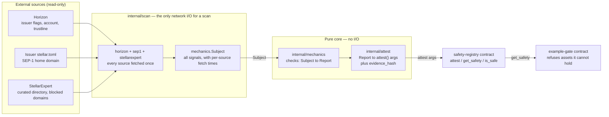
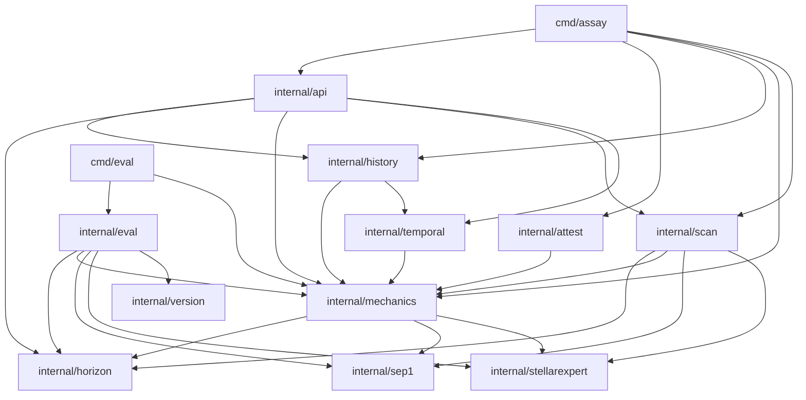

# Architecture

Assay is a small Go scanner plus two Soroban contracts. The pieces are easy to
read one at a time; this page is the one place that shows how they fit
together, and names the single rule that decides where each piece is allowed
to live.

## The rule that shapes everything

**Checks perform no I/O.**

`internal/scan` fetches everything a classification needs — once, up front —
and hands the result to a pure function. `internal/mechanics` turns that
pre-fetched `Subject` into a `Report`; it never opens a socket. This is what
makes the checks deterministic and testable from captured fixtures with no
network, and it is why a check cannot quietly grow a network dependency: it has
nowhere to put one.

The split is also the reason the leaf fetchers (`internal/horizon`,
`internal/sep1`, `internal/stellarexpert`) are separable. Each owns its own
transport and a clean signature, so it can be extracted into a shared
ledger-access library later without untangling judgment logic from HTTP.

## Data flow

From external sources, through the fetchers and the checks, to the on-chain
attestation and the contracts that read it:



A second path observes the same reports over time rather than acting on them:
`internal/mechanics` produces an observation, `internal/history` appends it,
and `internal/temporal` subtracts one observation from another to answer what
changed. `internal/api` exposes both the current scan and the history over
HTTP. Neither path feeds back into a check.

## Where I/O is confined

| Kind of I/O | Where it lives | Everything else |
| --- | --- | --- |
| Outbound HTTP for a scan | `internal/scan`, via the three leaf fetchers | Checks in `internal/mechanics` are pure |
| Outbound HTTP (raw) | `internal/horizon`, `internal/sep1`, `internal/stellarexpert` | Leaf packages; no internal dependencies |
| Filesystem (observation log) | `internal/history` | `internal/temporal` stores nothing, by design |
| Inbound HTTP (serving) | `internal/api` | The scanner it calls owns the outbound side |
| Filesystem (fixture replay) | `internal/eval` | Offline; never touches the network |

`internal/attest` performs **no I/O at all**. It deliberately does not derive
the Stellar Asset Contract address for an asset, because that needs a network
passphrase; deriving it is a separate, caller-owned step. Its output is a set
of `attest()` arguments and the bytes `evidence_hash` commits to.

## Package map

Every Go package, its responsibility, and the boundary it must respect.

| Package | Responsibility | Boundary |
| --- | --- | --- |
| `cmd/assay` | The `assay` binary: `scan`, `attestation`, `history`, `serve`. Parses arguments, wires the scanner and API, prints JSON. | Process entry point. Fetches nothing itself; delegates to `internal/scan` and `internal/api`. |
| `cmd/eval` | Records and diffs the labelled eval baseline. | Offline; reads fixtures through `internal/eval`. |
| `internal/api` | HTTP API (`/api/v1/scan`, `/api/v1/history`, `/healthz`) and the embedded single-file UI. | Inbound HTTP only. Does not fetch sources; it calls the scanner. Its one `horizon` import is the `ErrNotFound` sentinel, not a fetch. |
| `internal/scan` | The network edge for a scan: fetches every source once, assembles `mechanics.Subject` (and an optional holder trustline), then runs the engine. | **The only package that performs network I/O for a scan.** |
| `internal/mechanics` | The checks. Maps ledger flags and attributed source signals to `Finding`s, then aggregates them into a `Report` with severity and reasoning. | **No I/O.** A pure function from `Subject` to `Report`. |
| `internal/attest` | Canonicalises a `Report` into the exact `attest()` arguments, and specifies the `evidence_hash` preimage and encoding. | **No I/O of any kind.** |
| `internal/temporal` | Compares two observations of one asset to a transition: what changed between them. | No I/O and no storage; a pure function of its pair. |
| `internal/history` | Append-only, bounded per-asset observation log. | Filesystem I/O only; no network. |
| `internal/horizon` | Retrieves asset and issuer-account state from Horizon. | Outbound HTTP. Leaf package. |
| `internal/sep1` | Fetches and parses the issuer's `stellar.toml` for reciprocal domain verification. | Outbound HTTP. Leaf package. |
| `internal/stellarexpert` | Retrieves StellarExpert's curated directory and blocked-domain data as attributed evidence. | Outbound HTTP. Leaf package. |
| `internal/eval` | Replays the labelled corpus from captured fixtures through the engine; records and diffs the results. | Reads fixtures from disk; never the network. |
| `internal/version` | The scanner version identity recorded with every eval run. | No I/O. Leaf package. |

The two Soroban contracts:

| Contract | Responsibility | Boundary |
| --- | --- | --- |
| `safety-registry` | Stores attestations produced off-chain and serves them: `attest`, `get_safety`, `is_safe`, `is_safe_masked`, `revoke`, `init`. | On-chain only. A contract cannot fetch, so it does not scan — it stores a severity and a bitset that `evidence_hash` makes checkable. |
| `example-gate` | A worked integrator: refuses a deposit in an asset whose issuer can confiscate or freeze, by calling `get_safety`. | Depends only on the registry's interface, not on Assay at build time. |

## Dependency direction

The production import graph is acyclic. `internal/mechanics` is the centre: the
fetchers feed it, and everything that consumes a classification depends on it.
Two directions are worth stating explicitly because they are load-bearing:

- **`internal/attest` depends on `internal/mechanics`, never the reverse.** The
  evidence encoding can read `Report`; a check cannot reach into the hash
  encoding. The judgment layer and the commitment layer stay separable.
- **Checks depend only on fetched types, never on a fetcher's transport.**
  `internal/mechanics` imports the leaf packages for their types, not to call
  them.



This graph is the source of truth, and it can be checked directly rather than
by eye:

```sh
go list -deps ./... | grep use-assay
```

## Keeping this map current

Both diagrams are Mermaid source committed alongside the code, not images, so
they change in the same pull request as the packages they describe. When a
package is added, moved, or given a new boundary, update its row in the map
above, re-check the diagram against `go list`, and say which rule moved. A
change to the I/O boundary in particular is an architecture change, not a
refactor.
